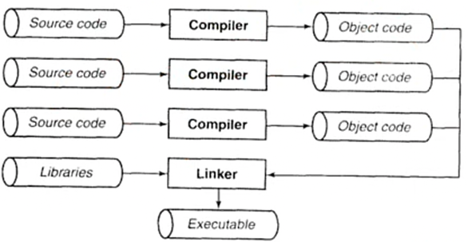
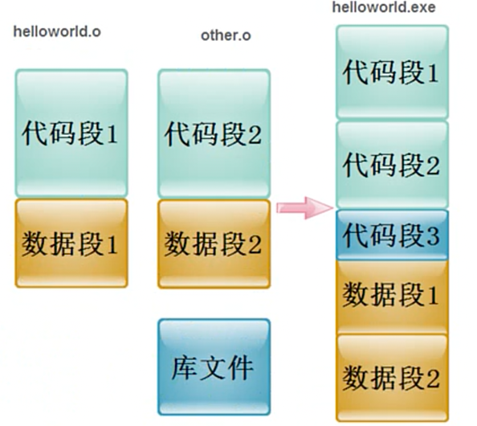
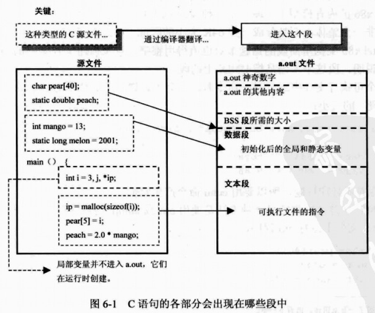
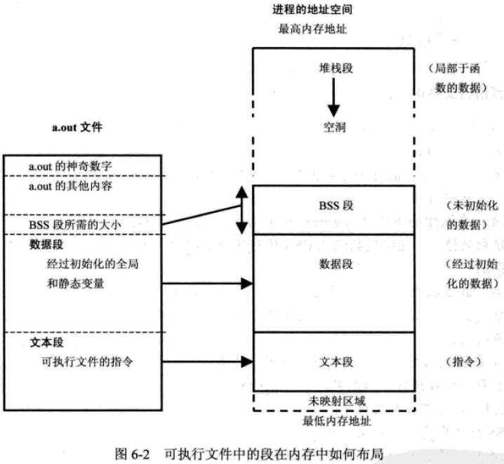

# C 语言简介

## 历史

C 语言最初是作为 Unix 系统的开发工具而发明的。

1969年，美国贝尔实验室的肯·汤普森（Ken Thompson）与丹尼斯·里奇（Dennis Ritchie）一起开发了 Unix 操作系统。Unix 是用汇编语言写的，无法移植到其他计算机，他们决定使用高级语言重写。但是，当时的高级语言无法满足他们的要求，汤普森就在 BCPL 语言的基础上发明了 B 语言。

1972年，丹尼斯·里奇和布莱恩·柯林汉（Brian Kernighan）又在 B 语言的基础上重新设计了一种新语言，这种新语言取代了 B 语言，所以称为 C 语言。

1973年，整个 Unix 系统都使用 C 语言重写。此后，这种语言开始快速流传，广泛用于各种操作系统和系统软件的开发。

1988年，美国国家标准协会（ANSI）正式将 C 语言标准化，标志着 C 语言开始稳定和规范化。

几十年后的今天，C 语言依然是最广泛使用、最流行的系统编程语言之一，Unix 和 Linux 系统现在还是使用 C 语言开发。

## C 语言的特点

C 语言能够长盛不衰、广泛应用，主要原因是它有一些鲜明的特点。

（1）低级语言

C 语言能够直接操作硬件、管理内存、跟操作系统对话，这使得它是一种非常接近底层的语言，也就是低级语言，非常适合写需要跟硬件交互、有极高性能要求的程序。

（2）可移植性

C 语言的原始设计目的，是将 Unix 系统移植到其他计算机架构。这使得它从一开始就非常注重可移植性，C 程序可以相对简单地移植到各种硬件架构和操作系统。

除了计算机，C 语言现在还是嵌入式系统的首选编程语言，汽车、照相机、家用电器等设备的底层系统都是用 C 语言编程，这也是因为它良好的可移植性。

遵循ANSI C标准的C语言程序, 理论上可以在多平台和OS上运行, 包括windows, macos, unix, linux等.

在移植的时候, 只要注意某些编译器的一些扩展特性就可以很轻松地在各个平台移植.

C语言在移植性上优于其他编程语言, 从8位单片机, 16位单片机到 32位arm, 64位arm架构以及PC x86上都有C语言的身影.

（3）简单性

C 语言的语法相对简单，语法规则不算太多，也几乎没有语法糖。一般来说，如果两个语法可以完成几乎相同的事情，C 语言就只会提供一种，这样大大减少了语言的复杂性。

而且，C 语言的语法都是基础语法，不提供高级的数据结构，比如 C 语言没有“类”（class），复杂的数据结构都需要自己构造。

（4）灵活性

C 语言对程序员的限制很少。它假设程序员知道自己在干嘛，不会限制你做各种危险的操作，你干什么都可以，后果也由自己负责。

C 语言的哲学是“信任程序员，不要妨碍他们做事”。比如，它让程序员自己管理内存，不提供内存自动清理功能。另外，也不提供类型检查、数组的负索引检查、指针位置的检查等保护措施。

表面上看，这似乎很危险，但是对于高级程序员来说，却有了更大的编程自由。不过，这也使得 C 语言的 debug 不太容易。

（5）总结

上面这些特点，使得 C 语言可以写出性能非常强、完全发挥硬件潜力的程序，而且 C 语言的编译器实现难度相对较低。但是另一方面，C 语言代码容易出错，一般程序员不容易写好。

还有强大的控制结构, 运行快速, 紧凑的代码程序更小.

- 强大的控制结构

  数据结构丰富: 32+5个关键字; 

  9种控制语句(顺序,选择,循环,跳转); 

  运算多样化: 40多种运算符, 15个优先级

- 紧凑的结构

  表达式简练

  程序结构简洁

  流程结构化

  程序模块化

  库函数的实现

- 快速

  目标代码质量高

  程序执行效率高

  编译器优化成熟

  代码检查限制少

此外，当代很多流行语言都是以 C 语言为基础，比如 C++、Java、C#、JavaScript 等等。学好 C 语言有助于对这些语言加深理解。

## C语言缺点

代码检查少

指针的使用: 野指针很危险

C的简洁性和丰富的运算符相结合, 导致程序难读

## C语言为何难学

因为要学的不仅仅是C语言, 要学的内容是整个计算机系统:

计算机系统和组成原理

程序的编译, 链接, 运行机制

标椎的理解

编译器的特性

存储的理解(代码跟数据在内存中如何存放, 生命周期)


如何学习

经典教材

学习方法

个人意志

## C 语言的标椎版本

历史上，C 语言有过多个标椎版本。

（1）K＆R C

`K&R C`指的是 C 语言的原始版本。1978年，C 语言的发明者丹尼斯·里奇（Dennis Ritchie）和布莱恩·柯林汉（Brian Kernighan）合写了一本著名的教材《C 程序设计语言》（The C programming language）。由于 C 语言还没有成文的语法标准，这本书就成了公认标准，以两位作者的姓氏首字母作为版本简称“K&R C”。

（2）ANSI C（又称 C89 或 C90）

C 语言的原始版本非常简单，对很多情况的描述非常模糊，加上 C 语法依然在快速发展，要求将 C 语言标准化的呼声越来越高。

1989年，美国国家标准协会（ANSI）制定了一套 C 语言标准。1990年，国际标准化组织（ISO）通过了这个标准。它被称为“ANSI C”，也可以按照发布年份，称为“C89 或 C90”。

（3）C95

1995年，美国国家标准协会对1989年的那个标准，进行了补充，加入多字节字符和宽字符的支持。这个版本称为 C95。

（4）C99

C 语言标准的第一次大型修订，发生在1999年，增加了许多语言特性，比如双斜杠（`//`）的注释语法。这个版本称为 C99，是目前最流行的 C 版本。

（5）C11

2011年，标准化组织再一次对 C 语言进行修订，增加了 Unicode 和多线程的支持。这个版本称为 C11。

（6）C17

C11 标准在2017年进行了修补，但发布是在2018年。新版本只是解决了 C11 的一些缺陷，没有引入任何新功能。这个版本称为 C17。

（7）C2x

标准化组织正在讨论 C 语言的下一个版本，据说可能会在2023年通过，到时就会称为 C23。

## C 语言的编译

C 语言是一种编译型语言，源码都是文本文件，本身无法执行。必须通过编译器，生成二进制的可执行文件，才能执行。编译器将代码从文本翻译成二进制指令的过程，就称为编译阶段，又称为“编译时”（compile time），跟运行阶段（又称为“运行时”）相区分。

目前，最常见的 C 语言编译器是自由软件基金会推出的 GCC 编译器，它可以免费使用。本书也使用这个编译器。Linux 和 Mac 系统可以直接安装 GCC，Windows 系统可以安装 MinGW。但是，也可以不用这么麻烦，网上有在线编译器，能够直接在网页上模拟运行 C 代码，查看结果，下面就是两个这样的工具。

- CodingGround: https://tutorialspoint.com/compile_c_online.php
- OnlineGDB: https://onlinegdb.com/online_c_compiler

本书的例子都使用 GCC 在命令行进行编译。

源文件(\*.c)→预处理→编译→汇编→链接→可执行文件

> 预处理 是gcc -E 参数执行, 处理宏定义与#include, 生成`.i`文件.
>
> 编译过程的结果是`.s`文件, 里面是汇编语言. 对这个汇编进行gcc -c, 就是汇编过程, 产生`.o`文件, 这个`.o`就是你的代码的内容的机器语言, 这个时候还没有link. 
>
> 链接过程, 就是把之前生成的`.o`文件, 跟你代码中使用的**库代码**, 以及**启动代码**链接在一起, 最终生成可执行文件.

**gcc命令参数**: 

`-E`：仅仅对代码进行预处理不编译
`-S`：只编译到汇编文件，不再汇编
`-c`：只编译生成目标文件，不链接
`-o`：指定输出的文件名
`-g`：生成带有调试信息的debug文件
`-O2`：编译器对代码优化等级，一般选择2
`-W`：在编译中开启警告(warning)信息
`-I`：指定头文件所在路径
`-l`：指定所使用的函数库
`-L`：指定函数库所在路径

## 链接



几个源文件, 经过编译生成`.o`目标文件, 这几个目标文件再经过链接器, 与库文件等链接在一起. 最终形成一个可执行的文件:



## Hello World 示例

C 语言的源代码文件，通常以后缀名`.c`结尾。下面是一个简单的 C 程序`hello.c`。它就是一个普通的文本文件，任何文本编译器都能用来写。

```c
#include <stdio.h>  //告诉编译器把stdio.h中的内容包含在当前程序中. 这个头文件是编译器的标准部分

int main(void) {         //main 总是第一个被调用的函数
  printf("Hello World\n");
  return 0;
}
```

> C程序包含一个或多个函数, 函数是C程序的基本模块.
>
> #include \<stdio.h> 就是用stdio.h中的内容来替换这一行预处理命令, 就是把stdio.h中的内容复制到这一行所在之处.
>
> #define 也是预处理命令. 预处理时会把名字, 替换成字面值.  
>
> 预处理命令由编译器中的预处理器解释.

上面这个程序的唯一作用，就是在屏幕上面显示“Hello World”。

这里不讲解这些代码是什么意思，只是作为一个例子，让大家看看 C 代码应该怎么编译和运行。假设你已经安装好了 GCC 编译器，可以打开命令行，执行下面的命令。

```bash
$ gcc hello.c
```

上面命令使用`gcc`编译器，将源文件`hello.c`编译成二进制代码。注意，`$`是命令行提示符，你真正需要输入的是`$`后面的部分。

运行这个命令以后，默认会在当前目录下生成一个编译产物文件`a.out`（assembler output 的缩写，Windows 平台为`a.exe`）。执行该文件，就会在屏幕上输出`Hello World`。

```bash
$ ./a.out
Hello World
```

GCC 的`-o`参数（output 的缩写）可以指定编译产物的文件名。

```bash
$ gcc -o hello hello.c
```

上面命令的`-o hello`指定，编译产物的文件名为`hello`（取代默认的`a.out`）。编译后就会生成一个名叫`hello`的可执行文件，相当于为`a.out`指定了名称。执行该文件，也会得到同样的结果。

```bash
$ ./hello
Hello World
```

GCC 的`-std=`参数（standard 的缩写）还可以指定按照哪个 C 语言的标准进行编译。

```bash
$ gcc -std=c99 hello.c
```

上面命令指定按照 C99 标准进行编译。

注意，`-std`后面需要用`=`连接参数，而不是像上面的`-o`一样用空格，并且`=`前后也不能有多余的空格。

## 程序存储的方式

冯诺依曼模型, 把外存储器上的程序, 加载到内存中, 由CPU自动执行. 要让CPU执行程序一般有加载到执行这个过程:

**程序加载**

程序的二进制文件放在了硬盘上(外存储器上), 加载过程就是把这个可执行的二进制文件里的机器码, 拷贝到内存的线性区域中. 然后CPU中的PC寄存器指向程序的第一条指令.

上电执行

程序加载


单片机或者裸机, 程序是烧写到flash上, 一上电会有一段内置在CPU中的汇编代码, 这段代码初始化必要的设备, 然后把烧写到flash中的镜像程序, 拷贝到内存中, 然后跳到内存中去执行.

有操作系统的机器, 则由操作系统来负责任务调度.

执行过程就是CPU的取指令, 翻译指令, 取数据, 执行指令, 如此重复.

下面选自《C专家编程》





## 程序安装原理

裸机系统, 镜像烧写

> 程序烧写在flash中, 启动时由启动代码把存在flash中的镜像程序拷贝到内存中, 跳转直到第一条指令执行.

操作系统,文件系统

> 程序加载由操作系统来完成.

程序的存储环境

程序的运行环境

- 安装过程

  将可执行程序文件拷贝到目标目录位置

  往系统目录拷贝必要的库文件(可选)

  向系统注册程序或者库的安装信息(可选)

  在开始菜单或桌面上建立快捷方式(可选)