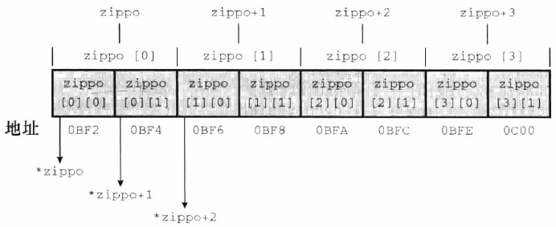

# 指针

指针是 C 语言最重要的概念之一，也是最难理解的概念之一。

## 地址与指针

指针是什么？首先，它是一个值，这个值代表一个内存地址，因此指针相当于指向某个内存地址的路标。

字符`*`表示指针，通常跟在类型关键字的后面，表示指针指向的是什么类型的值。比如，`char*`表示一个指向字符的指针，`float*`表示一个指向`float`类型的值的指针。这其实也就交代了这个指针的寻址方式, 是按字节还是字.

```c
int* intPtr; 
char* chptr;
struct xx* stPtr;
```

上面示例声明了一个变量`intPtr`，它是一个指针，指向的内存地址存放的是一个整数。

这个变量 `inptr`,  他的值, 是个内存地址, 这个地址, 里面存放着`int`型变量. 所以这个`inptr`也要占用一定的内存空间. 

由于它存的是地址, ***所以占用空间`只跟编译器`有关***, 64位系统下, 编译器不同, 地址长度也可能是4字节或8字节.

**在编译完成后, 指针大小就由编译器确定了. 跟在哪运行没关系.**

星号`*`可以放在变量名与类型关键字之间的任何地方，下面的写法都是有效的。

```c
int   *intPtr;
int * intPtr;
int*  intPtr;
```

本书使用星号紧跟在类型关键字后面的写法（即`int* intPtr;`），因为这样可以体现，指针变量就是一个普通变量，只不过它的值是内存地址而已。

这种写法有一个地方需要注意，如果同一行声明两	个指针变量，那么需要写成下面这样。

```c
// 正确
int * foo, * bar;

// 错误
int* foo, bar;
```

上面示例中，第二行的执行结果是，`foo`是整数指针变量，而`bar`是整数变量，即`*`只对第一个变量生效。

一个指针指向的可能还是指针，这时就要用两个星号`**`表示。这种指针称为二级指针.

```c
int** foo; //最终指向int的变量, 但这个指针是先指向一个指针, 指向的指针里存着int变量的地址.
int a = 10;
int *p = &a; 
int **foo = &p; /*foo 对foo的值(p的地址)解引用得到p的值(a地址), **foo对a的地址解引用得到a的值
```

上面示例表示变量`foo`是一个指针，指向的还是一个指针，第二个指针指向的则是一个整数。

## * 运算符

`*`这个符号除了表示指针以外，还可以作为运算符，用来取出指针变量所指向的内存地址里面的值。

```c
void increment(int* p) {
  *p = *p + 1;
}
```

上面示例中，函数`increment()`的参数是一个整数指针`p`。函数体里面，`*p`就表示指针`p`所指向的那个值。对`*p`赋值，就表示改变指针所指向的那个地址里面的值。

上面函数的作用是将参数值加`1`。该函数没有返回值，因为传入的是地址，函数体内部对该地址包含的值的操作，会影响到函数外部，所以不需要返回值。事实上，函数内部通过指针，将值传到外部，是 C 语言的常用方法。

变量地址而不是变量值传入函数，还有一个好处。对于需要大量存储空间的大型变量，复制变量值传入函数，非常浪费时间和空间，不如传入指针来得高效。

## & 运算符

`&`运算符用来取出一个变量所在的内存地址。

```c
int x = 1;
printf("x's address is %p\n", &x);
```

上面示例中，`x`是一个整数变量，`&x`就是`x`的值所在的内存地址。`printf()`的`%p`是内存地址的占位符，可以打印出内存地址。

上一小节中，参数变量加`1`的函数，可以像下面这样使用。

```c
void increment(int* p) {
  *p = *p + 1;
}

int x = 1;
increment(&x);
printf("%d\n", x); // 2
```

上面示例中，调用`increment()`函数以后，变量`x`的值就增加了1，原因就在于传入函数的是变量`x`的地址`&x`。

`&`运算符与`*`运算符互为逆运算，下面的表达式总是成立。

```c
int i = 5;

if (i == *(&i)) // 正确
```

## 指针变量

- 定义, 初始化

- 引用

  指针变量的地址 `&p`

  指针变量的值   `p`

  指针变量指向的 地址 上的内容 `*p`

- 指针的运算

- 指针的算术运算

## 指针变量的初始化

声明指针变量之后，编译器会为指针变量本身分配一个内存空间，但是这个内存空间里面的值是随机的，也就是说，指针变量指向的值是随机的。这时一定不能去读写指针变量指向的地址，因为那个地址是随机地址，很可能会导致严重后果。

```c
int* p; //要养成指针声明即定义的好习惯  int* p = NULL;
*p = 1; // 错误
```

上面的代码是错的，因为`p`指向的那个地址是随机的，向这个随机地址里面写入`1`，会导致意想不到的结果。

正确做法是指针变量声明后，必须先让它指向一个分配好的地址，然后再进行读写，这叫做指针变量的初始化。

```c
int* p;
int i;

p = &i;
*p = 13;
```

上面示例中，`p`是指针变量，声明这个变量后，`p`会指向一个随机的内存地址。这时要将它指向一个已经分配好的内存地址，上例就是再声明一个整数变量`i`，编译器会为`i`分配内存地址，然后让`p`指向`i`的内存地址（`p = &i;`）。完成初始化之后，就可以对`p`指向的内存地址进行赋值了（`*p = 13;`）。

为了防止读写未初始化的指针变量，可以养成习惯，将未初始化的指针变量设为`NULL`。

```c
int* p = NULL;
```

`NULL`在 C 语言中是一个常量，表示地址为`0`的内存空间，这个地址是无法使用的，读写该地址会报错。

## 指针的运算

**指针本质上就是一个无符号整数**，**代表了内存地址**。它可以进行运算，但是规则并不是整数运算的规则。

（1）指针与整数值的加减运算

指针与整数值的运算，表示指针的移动。

```c
short* j;    //本质是寻址方式
j = (short*)0x1234;
j = j + 1; // 0x1236
```

上面示例中，`j`是一个指针，指向内存地址`0x1234`。你可能以为`j + 1`等于`0x1235`，但正确答案是`0x1236`。原因是`j + 1`表示指针向内存地址的高位移动一个单位，而一个单位的`short`类型占据两个字节的宽度，所以相当于向高位移动两个字节。同样的，`j - 1`得到的结果是`0x1232`。

指针移动的单位，与指针指向的数据类型有关。数据类型占据多少个字节，每单位就移动多少个字节。

（2）指针与指针的加法运算

**指针只能与整数值进行加减运算，两个指针进行加法是非法的。**

```c
unsigned short* j;
unsigned short* k;
x = j + k; // 非法
```

上面示例是两个指针相加，这是非法的。

（3）指针与指针的减法

**相同类型的指针允许进行减法运算，返回它们之间的距离，即相隔多少个数据单位。**

高位地址减去低位地址，返回的是正值；低位地址减去高位地址，返回的是负值。

这时，减法返回的值属于`ptrdiff_t`类型，这是一个**带符号的整数类型别名**，具体类型根据系统不同而不同。这个类型的原型定义在头文件`stddef.h`里面。 

```c
short* j1;
short* j2;

j1 = (short*)0x1234;
j2 = (short*)0x1236;

ptrdiff_t dist = j2 - j1;
printf("%td\n", dist); // 1
```

上面示例中，`j1`和`j2`是两个指向 short 类型的指针，变量`dist`是它们之间的距离，类型为`ptrdiff_t`，值为`1`，因为相差2个字节正好存放一个 short 类型的值。

（4）指针与指针的比较运算

指针之间的比较运算，比较的是各自的内存地址哪一个更大，返回值是整数`1`（true）或`0`（false）。

## 指针的重要性

- 提供函数修改实参的方法, 模拟引用调用
- 支持动态内存分配
- 支持动态分配的数组
- 支持动态数据结构: 二叉树, 链表等
- 指针常用于数组的操作, 寻址遍历数组, 效率比数组下标快.
- 高效地, 按引用"复制"数组和结构, 特别是作为函数参数时.
- C的精华就是指针, 直接对内存操作. 没学好指针, 就是没学好C.

## 指向数组的指针

- 数组与指针的关系

  数组与指针的联系:

  - 数组名可看作常量指针(地址);
  - 数组作为参数, 退化为指针.(不论几维数组);

  数组与指针的区别:

  - 数组是一个构造类型, 指针是一种存放地址的变量
  - 保存的值不同, 指针存地址, 数组存数据.
  - 访问值的方式不同: 指针通过\*间接访问, 数组通过a[]下标直接访问, 也可以用\*间接访问*(a+2);

  数组名与指针:

  - 数组名是首元素首地址的别名, 别名不占内存空间. 而指针是个变量, 需要有个内存空间, 来存放地址值.

    ```asm
    ; 看看汇编对于数组名跟指针变量 
    ; int global_val = 10; 
    ; int array[10] = {1,2,3,4,5,6,7,8,9,0};
    ; int* p = &global_val;   看看这三行代码的汇编
    .global p
    		.align 4
    		.type  p, @object
    		.size  p, 4
    p: 		
    		 .long global_val
    .global array
    		  .align 32    
    		  .type  array, @object
    		  .size  array, 40 ;40 bytes
    array:
              .long   1 ;所以数组名array 就是首元素的地址
               ........
               .long  0 ;1到0十个数 
      
     ;linux内核符号表放在了 /proc/kallsyms 可以看看
     ;C语言的函数跟变量会存在符号表里.
    ```

  - 数组名的外延在于它可以作为基地址, 从而转换成指向各个元素的指针. 而且数组名是地址常量.

- 数组指针的定义,初始化, 引用

  指针, 可以指向数组元素, 也可以指向整个数组空间.

  ```c
  int a[5] = {1,2,3,4};
  int* p = &a[0]; //int* p = a;都可以
  ```

  用汇编的概念, 把数组当作一个段地址, 数组名, 就是这个段的段地址或者叫基地址. 里面的元素全是偏移地址.

- **为什么说数组下标比较慢呢?**

  因为取`a[i]` 就是 `addr = a+i*sizeof(int)` 得到元素地址, 再对算出来的地址`*addr` 取值.

  要用到乘法, 肯定比`*(a+i)` 只用加法要慢. 所以这个细节值得注意.

- 数组指针作为函数的参数

  数组名作函数参数, 会退化为一个常量指针, 地址常量.

- 再讨论a与&a的区别

  指向数组元素的指针

  ```c
  int a[10] = {0};
  *(a + 1);
  a + 1 等价于 a的地址加上1*sizeof(元素类型)的偏移量.
  ```

  指向整个数组的指针

  指针指向的是整块数组, 把整块数组看做一个整体.

  ```c
  int a[10] = {0}; 
  &a + 1 指向的是40个字节之后的地址.
      
  //跟上面等价的声明方式:
  int (* P)[10] = &a; //这里p指向的是把int a[10]看做一个整体的东西
  p+1 也是跳40个字节.    //这样也就好理解二维数组了.
     
  //若是:
  int *p = a;
  p+1 就只跳4个字节.
  ```

## 指向二维数组的指针

二维数组, 也是一维存放. 

声明一个`int a[2][3];` 可以看做是两个数组a[0] 和 a[1] :

`a[0]`  : `a[0][0]` `a[0][1]` `a[0][2]`.  

`a[1]`  : `a[1][0]` `a[1][1]` `a[1][2]`

a[0] 和 a[1] 里面的元素还是个数组.

a[0] 指向的就是 a[0] 这个数组首元素的地址 `&a[0][0]`. 这个数组的数组名就是a[0].

`*a == a[0]`. 对二维数组名解引用的值, 就是`a[0][0]`的地址. *(a+1) 就是`a[1][0]`的地址. 那么,

对于 `*(*(a+i)+j)` , 就是先找到第n行首元素地址, 然后在偏移n列, 找到元素地址, 再解引用得到值.



```c
int a[3][3] = {{1,2,3}, {4,5,6},{7,8,9}};
int (*p)[3] = a; // 所以*(a+1) 就是a[1]数组的首地址 
                  // *(*(a+1)+1) 来访问a[1][1]的值
指向二维数组的指针一定是  数据类型 (*p)[长度] = 数组名;
```

由上面一维数组可以知道, 此时 p指针指向的, 是一个把`int [3]`作为整体的东西. 所以`p+1`就是 a[1]的地址而不是a[1]的值. `p+2` 就是a[2]的地址而不是值. `*(p+1)` 就是a[1]的值, a[1]的值就是`&a[1][0]`. 那`*(*(p+1)+1)`就是`a[1][1]`中的值. 

## 二维数组指针做函数参数

```c
int addArray(int a[][5]);
int addArray(int a[5][5]); 
int addArray(int (*p)[5]); 这三种写法都可以.
```

## 重复:变量的存储

- 程序的内存分布

  可执行文件, 代码段就拷贝到运行时内存的代码段.

  而数据段, 则分为静态和动态两个区. 静态区又分 .bss段 和 data段. 对于.bss段中没有初始化的全局变量, header中会记录他们的长度, 运行时会给在.bss中分配内存.

  动态内存区, 有stack跟heap.

- 变量的地址, 变量的值, 变量名

- 对于一个变量名, 编译器通过符号表位变量名和变量的地址之间建立关联

- 对变量进行读写时, 系统通过符号表找到该变量的地址, 然后直接对该地址进行读写操作.

  ```asm
  ;这个部分我们可以在汇编代码中看到 比如:
  ;c语言中 定义全局变量 int global_var = 10;对应下面的汇编
  .global global_val
  		.data
  		.align 4  ;偏移量, 就是根据data段的基地址偏移多少, 也是汇编的内容
  		.type   global_var, @object
  		.size   global_val, 4
  global_val:
      	.long   10
  
  ;这里就是符号表与变量地址建立关联, 通过这个符号, 就能找到这个变量的地址.
  ;进入到函数内部, 对局部变量就完全不一样了.
  ```

  这个符号表就是编译器把程序里所有的符号搜集起来, 形成一张符号表.

## 注意点

- `swap(int a, int b);` 与 ``swap(int* a, int *b);`` 的区别
- **指针变量必须要先初始化, 然后再引用**

## 数组指针, 指针数组

数组指针, 本质(名词的主体)是个指针, 指向数组的指针.

```c
int a[3], b[2][3];
int *p = a;
int (*p)[3] = b;
```


指针数组, 本质(名字的主体)是个数组, 数组里存的元素, 就是指针. 

```c
char *str[3] ={ // [] 的优先级最高 高于 * 说明数组str[3] 里存放的都是char *类型的指针.
    "hellow",
    "world",
    "bye"
};
打印出来:
sizeof char *str[3] = 24
str[0] addr = 0x7ffc3eb0e520, val = 0x5651d19df025, *str[0] = hello
str[1] addr = 0x7ffc3eb0e528, val = 0x5651d19df02b, *str[1] = World
str[2] addr = 0x7ffc3eb0e530, val = 0x5651d19df031, *str[2] = bye
可以看到字符串常量, 存放在了静态内存区.
int a = 1, b = 2, c = 3;
int* p[3] = {&a, &b, &c};
```

上面字符数组,  存放了三个字符串的**首地址**, 所以, str数组是3个内存地址的长度.

指针数组, 就是存放n个内存地址. 而且是连续存放的. 然后里面的指针元素指向的是char类型.

- 指针数组作函数参数

```c
void printFunc(int len, char *ps[]); //这样就可以了.
```

## 字符串与指针

- 字符串指针的定义, 初始化与使用

  ```c
  //字符串字面量以数组的形式存在静态内存区; 指针变量在栈中, 指向这块静态存储区.
  char *str = "hello world!"; 
  //也可以用循环把字符串打印出来
  ```

- 字符串指针作为函数的参数

  ```c
  void stringCpy(char *dest, const char *src)
  {
      while((*dest++ = *src++) != '\0');
  }
  //举例:
  char *src = "hello"; //内存里就是h e l l o \0
  char dest[20] = "we are famulei";//这里注意如果dest比src空间小. 有可能就会越界.
  stringCpy(dest, src); //dest中的数据: hello\0 famulei\0 所以按%s打印, 就到hello就没了
  ```

- 字符串指针变量与字符数组的区别

  字符数组, 是个数组, 可以在动态和静态内存区, 里面每个元素都是char. 不自动加'\0' 作为结尾.

  字符串指针变量, 指针变量可以在静态或动态区, 而字符串字面量, 保存在静态区.

## 二级指针

指向指针的指针变量, 就是二级指针. ( 理解: 变量的地址, 变量的值.)

```c
int i = 8;
int* p = &i;
int** pp = &p; //pp中的值就是p的地址, *pp就能取到p的值, P的值, 是i的地址, 所以**pp就是i的值.
```

二级指针操作变量, 二级指针操作数组, 核心还是, 理解变量的地址, 变量的值.对地址解引用得到地址里的值.

二级指针操作指针数组.

```c
char *str[] ={
  "hello",
  "world",
  "goodbye"
};
char **p = str; //p是数组元素的地址, *p得到的数组元素的值(内存地址). **P 就是最终的值.但是字符串打印,给*p就行.
printf("%s \n", *(p+1)); //str[1]的值
```

二级指针作函数参数

```c
void arrayPrint(unsigned len, char **p);
```

## 指向函数的指针

C语言无论是定义变量还是定义函数 ,都是个符号(token), 根据符号表找对应的地址. 

指向函数的指针, 就是函数指针.

```c
int (*funptr)(int, int);
int addFunc(int , int);

int addFunc(int a, int b)
{
    return a+b;
}
funptr = addFunc;
funptr(a,b);// (*funptr)(a,b);   (**funptr)(a,b); 不论解多少次引用, 得到的都是函数入口地址.
```

函数指针作为函数的参数.

```c
//接上面的代码
void calc(int a, int b, int (*fp)(int x, int y));
void calc(int a, int b, int (*fp)(int x, int y))
{
    int reslt = fp(a,b);
    printf("result = %d\n", reslt);
}
int main()
{
    int a = 3 , b = 4;
    calc(a, b, addFunc);
}
```

## 指针函数

就是返回值是指针的函数.

```c
char* getMonth(int n);
```

**重要注意点:**

**返回的指针, 注意它的生命周期, 不能返回一个已经被释放掉的地址.**

虽然能访问取值, 但你往里面写数据, 就会出问题. 因为这个地址, 可能会被系统分配给别人用.